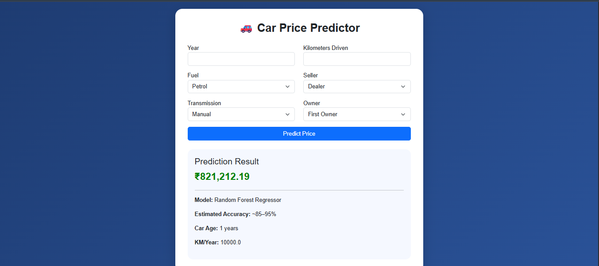
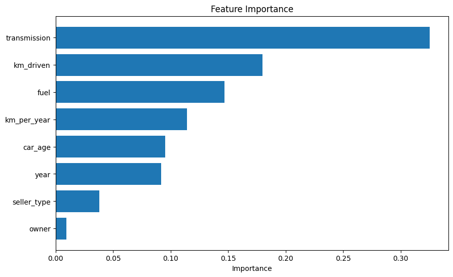
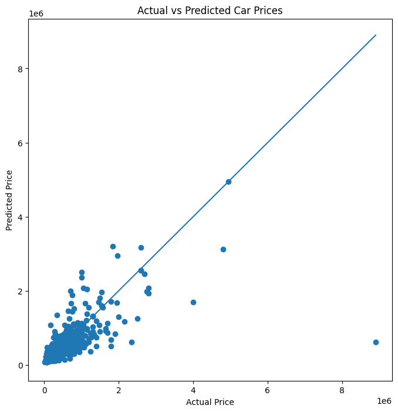

# 🚗 Car Price Prediction System

An end-to-end Machine Learning web application that predicts the resale price of a car based on important vehicle features such as year, kilometers driven, fuel type, transmission, seller type, and ownership history.

This project combines a trained ML model with a Flask backend and a responsive front-end interface to deliver real-time price predictions.

---

## 🌐 Live Demo

**Deployed App:**  
https://car-price-prediction-vert.vercel.app/

---

## Project Preview



## Feature Importance



## Prediction Performance



---

## ✨ Features

- Machine learning-based car price prediction
- Clean and responsive UI
- Real-time prediction output
- Feature engineering for better performance
- Input validation and error handling
- Flask backend integration
- Deployed on Vercel
- Supports both web form and model inference

---

## 🧠 Machine Learning Workflow

### Data Processing
- Data cleaning
- Missing value handling
- Label encoding
- Feature selection

### Feature Engineering
The following engineered features were added to improve model performance:

- **Car Age**
- **Kilometers Per Year**

These help improve prediction quality.

---

## 🛠️ Tech Stack

### Frontend
- HTML5
- CSS3
- Bootstrap

### Backend
- Python
- Flask

### Machine Learning
- Pandas
- NumPy
- Scikit-learn

### Deployment
- Vercel
- Gunicorn

---

## 📂 Project Structure

```bash
car_price_prediction/
│
├── app/
│   ├── utils.py
│   ├── Car_Pred_Model.pkl
│   ├── Column.json
│   └── encoded_data.json
│
├── templates/
│   └── index.html
│
├── CONFIG.py
├── main.py
├── requirements.txt
├── vercel.json
├── .env
├── .gitignore
└── README.md
```

---

## ⚙️ Installation and Setup

### Clone the repository

```bash
git clone https://github.com/roshankodi/car-price-prediction.git
cd car-price-prediction
```

### Create and activate a virtual environment

Windows:

```bash
python -m venv .venv
.venv\Scripts\activate
```

Mac/Linux:

```bash
python3 -m venv .venv
source .venv/bin/activate
```

### Install dependencies

```bash
pip install -r requirements.txt
```

### Run the application

```bash
python main.py
```

Open the app in your browser:

```bash
http://127.0.0.1:5000
```

---

## 📊 Example Prediction

### Input

| Feature | Value |
|--------|-------|
| Year | 2018 |
| Kilometers Driven | 45000 |
| Fuel Type | Petrol |
| Seller Type | Dealer |
| Transmission | Manual |
| Owner | First Owner |

### Output

```bash
Predicted Price: ₹543,870.26
```

---

## 🚀 Future Improvements

- Add model comparison dashboard
- Improve prediction accuracy
- Add visual analytics
- Add prediction confidence ranges
- Add user authentication
- Store prediction history

---

## 👨‍💻 Author

### Kodi Roshan

- GitHub: [https://github.com/roshankodi](https://github.com/roshankodi)
- LinkedIn: [https://www.linkedin.com/in/kodi-roshan-78858b356](https://www.linkedin.com/in/kodi-roshan-78858b356)
- Portfolio: [https://roshankodi.github.io/portfolio-me/](https://roshankodi.github.io/portfolio-me/)

---

## 🙏 Credits

This project was built using open-source tools and libraries:

- Flask
- NumPy
- Pandas
- Scikit-learn
- Bootstrap

The machine learning workflow and regression approach were inspired by standard automobile resale prediction techniques.

---

## ⭐ Support

If you found this project useful:

- Star the repository
- Fork the project
- Share feedback

---

<p align="center">
Made with Python, Machine Learning, and Flask 🚀
</p>